<p align="center">
  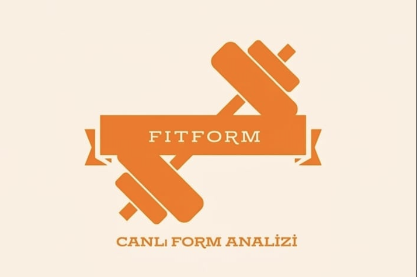
</p>
<h1 align="center">FitForm AI</h1>
<p align="center">
  <strong>Yapay Zeka Destekli Gerçek Zamanlı Egzersiz Form Analiz Uygulaması</strong>
</p>
<p align="center">
  
  
  
  
  
  
</p>

## Hakkında

FitForm AI, cihazın ön kamerasını kullanarak egzersiz sırasında vücut formunu **gerçek zamanlı** analiz eden bir Android uygulamasıdır. Google **MediaPipe Pose Landmarker** modeli ile 33 eklem noktası algılanır, biyomekanik kurallara dayalı açı hesaplamalarıyla form değerlendirilir ve kullanıcıya anlık geri bildirim sunulur.

> **Hedef Kitle:** Spor salonuna gidemeyen, kişisel antrenör desteği alamayan veya evde egzersiz yapan bireyler.
<!-- GÖRSEl: Uygulamanın 4 ana ekranının yan yana mockup'ları -->
<!-- Eklenecek görsel: docs/images/app_showcase.png -->
<p align="center">
  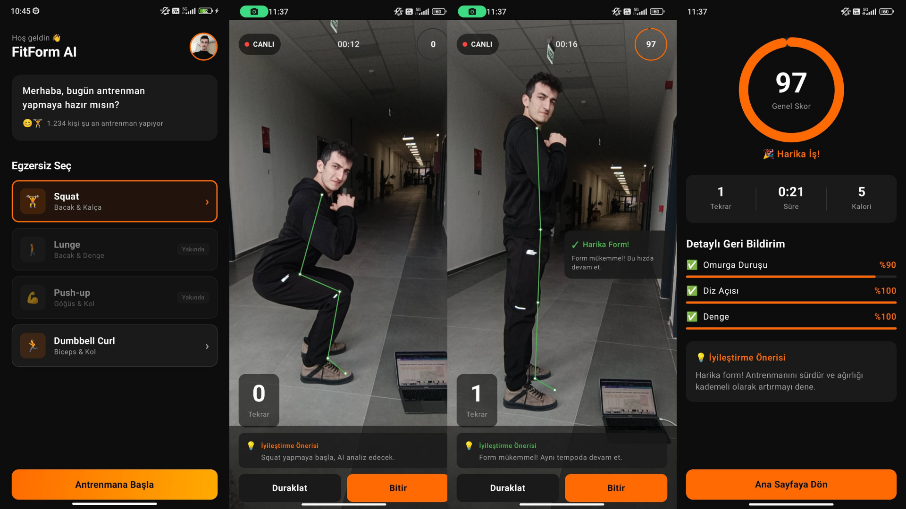
</p>

---

## Özellikler

### Gerçek Zamanlı Poz Analizi
- MediaPipe Pose Landmarker ile **33 eklem noktası** algılama
- GPU hızlandırmalı çıkarım (desteklenmezse otomatik CPU fallback)
- **Dominant taraf** otomatik tespiti (yandan görünüm analizi)
- Egzersize özel iskelet çizimi (yalnızca ilgili eklem noktaları)

### Desteklenen Egzersizler

| Egzersiz | Durum | Analiz Edilen Metrikler |
|----------|-------|------------------------|
| **Squat** | ✅ Aktif | Diz açısı, kalça açısı, gövde eğimi, diz-ayak ucu ilişkisi |
| **Dumbbell Curl** | ✅ Aktif | Dirsek açısı (ROM), üst kol sabitliği, gövde sallanması |
| **Lunge** | 🔜 Yakında | — |
| **Push-up** | 🔜 Yakında | — |

### Akıllı Başlangıç Sistemi
Üç aşamalı doğrulama ile güvenilir analiz başlangıcı:

1. **Pozisyon Kontrolü** — İlgili eklem noktalarının kamera tarafından algılandığı doğrulanır
2. **Hareketsizlik Tespiti** — 3 saniye boyunca stabil pozisyon beklenir (açı + pozisyon delta kontrolü)
3. **Geri Sayım** — 5 saniyelik hazırlık süresi
<!-- GÖRSEl: Başlangıç akışının 3 aşamasını gösteren ekran görüntüleri -->
<!-- Eklenecek görsel: docs/images/startup_flow.png -->
<p align="center">
  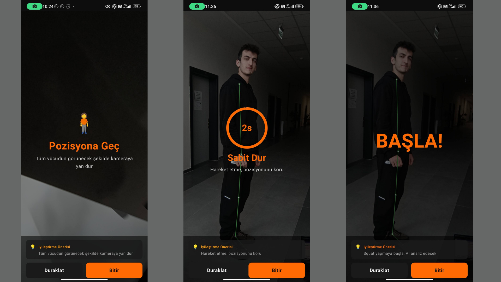
</p>

### Anlık Geri Bildirim
- **Yeşil** — Mükemmel form
- **Turuncu** — Düzeltme gereken durum
- **Kırmızı** — Kritik form hatası
- Debounce mekanizması ile akıcı bildirim geçişleri (minimum 1.5s gösterim)

### Performans Puanlama
- Her tekrar sonrası **0-100 arası** detaylı puanlama
- Kategori bazlı değerlendirme: Omurga Duruşu, Kol Pozisyonu, Denge
- Antrenman sonrası kapsamlı özet ekranı

---


## Ekran Görüntüleri

<!-- Her ekran görüntüsü için docs/images/ klasörüne ilgili dosyaları ekleyin -->

| Giriş Ekranı | Ana Sayfa | Analiz (Squat) | Analiz (Curl) |
|:---:|:---:|:---:|:---:|
| 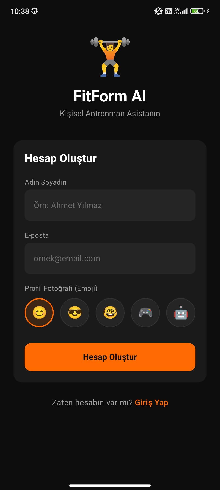 | 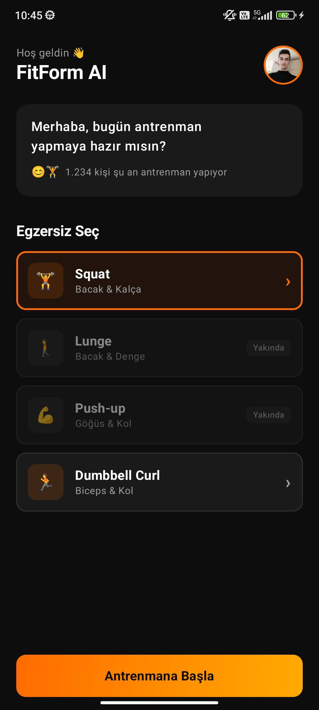 | 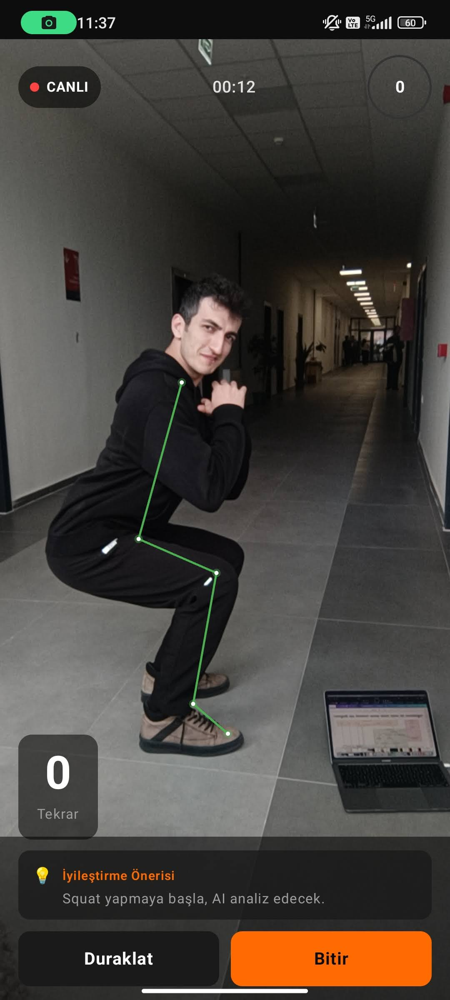 | 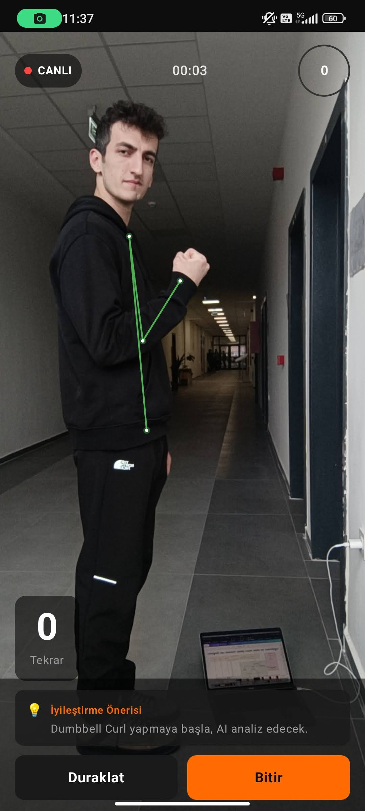 |

| Geri Sayım | Anlık Geri Bildirim | Özet Ekranı | Profil |
|:---:|:---:|:---:|:---:|
| 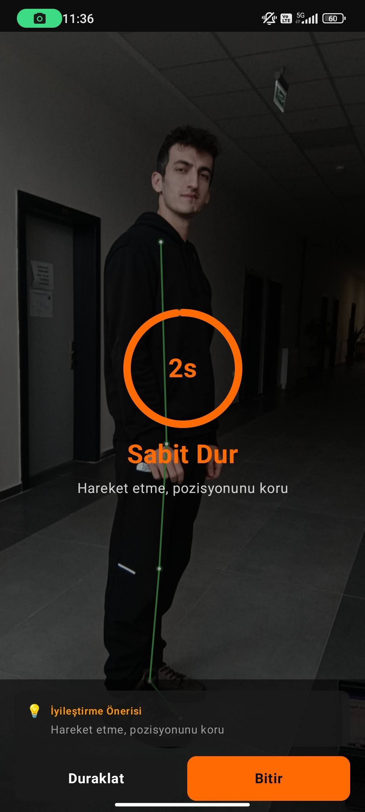 | 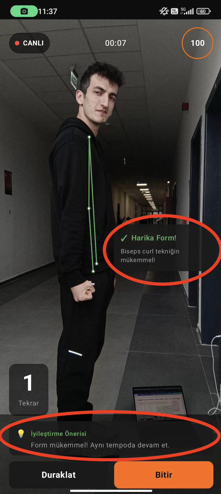 | 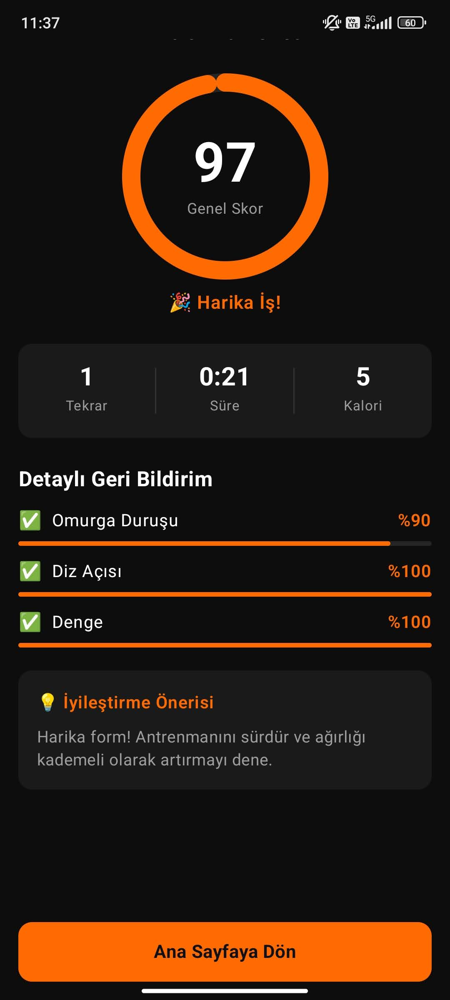 | 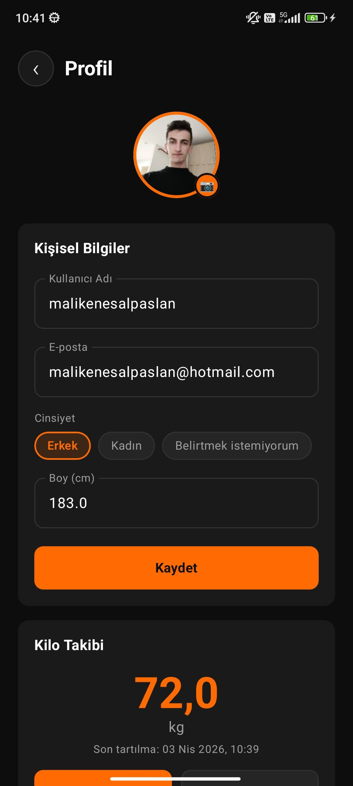 |

---

## Mimari

Uygulama katmanlı mimari yapısı ile geliştirilmiştir:

```
com.formfit.ai/
├── analysis/                    # Analiz Katmanı
│   ├── PoseDetectorHelper.kt   # MediaPipe entegrasyonu
│   ├── AngleCalculator.kt      # Eklem açısı hesaplamaları
│   ├── SquatAnalyzer.kt        # Squat durum makinesi (8 faz)
│   ├── CurlAnalyzer.kt         # Curl durum makinesi (8 faz)
│   └── OverlayView.kt          # Egzersize özel iskelet çizimi
├── data/                        # Veri Katmanı
│   ├── model/
│   │   ├── User.kt             # Kullanıcı modeli + vücut ölçüleri
│   │   ├── Exercise.kt         # Egzersiz modeli
│   │   └── WorkoutResult.kt    # Antrenman sonucu modeli
│   └── FakeDataSource.kt       # In-memory veri kaynağı
├── ui/                          # UI Katmanı (Jetpack Compose)
│   ├── screens/
│   │   ├── LoginScreen.kt      # Giriş ekranı
│   │   ├── HomeScreen.kt       # Egzersiz seçim ekranı
│   │   ├── AnalysisScreen.kt   # Gerçek zamanlı analiz
│   │   ├── SummaryScreen.kt    # Antrenman özeti
│   │   └── ProfileScreen.kt    # Profil ve vücut ölçüleri
│   ├── navigation/
│   │   └── NavGraph.kt         # Ekran navigasyonu
│   ├── viewmodel/
│   │   └── WorkoutViewModel.kt # UI durum yönetimi
│   └── theme/                   # Neon Orange tema
└── MainActivity.kt
```

<!-- GÖRSEl: Mimari diyagramı -->
<!-- Eklenecek görsel: docs/images/architecture.png -->
<p align="center">
  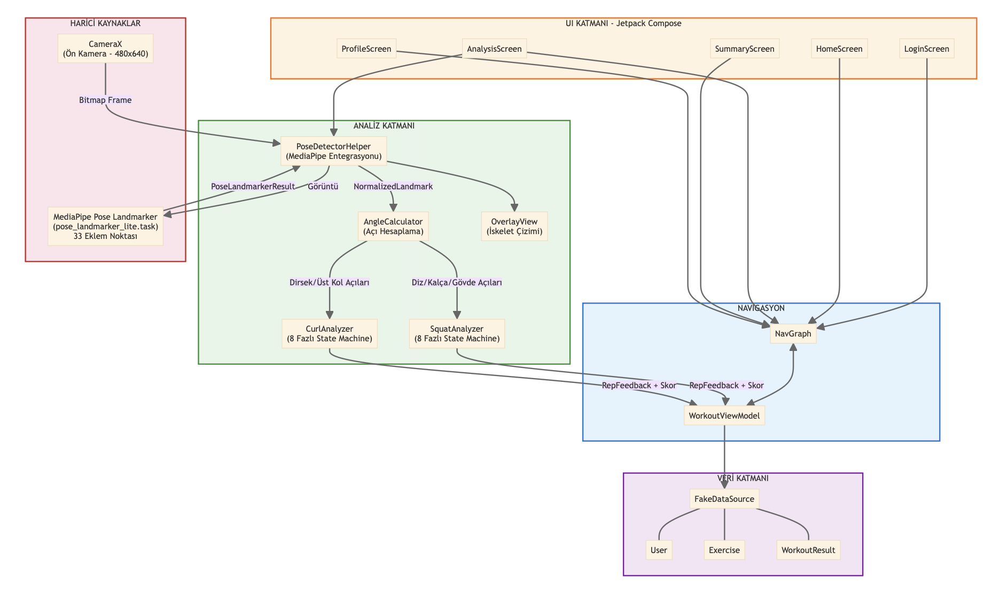
</p>

### Durum Makinesi (State Machine) Akışı

```
WAITING_FOR_POSE → POSE_DETECTED → COUNTDOWN → [Aktif Fazlar] → COMPLETED
                       ↑    ↓                       ↑              ↓
                    (hareket algılanırsa              └──────────────┘
                     geri döner)                      (sonraki tekrar)
```

**Squat Fazları:** STANDING → DESCENDING → BOTTOM → ASCENDING → COMPLETED

**Curl Fazları:** READY → CURLING → TOP → LOWERING → COMPLETED

---

## Teknoloji Yığını

| Kategori | Teknoloji | Versiyon |
|----------|-----------|----------|
| **Dil** | Kotlin | — |
| **UI Framework** | Jetpack Compose | BOM |
| **Navigasyon** | Navigation Compose | 2.8.5 |
| **Kamera** | CameraX | 1.4.1 |
| **Poz Algılama** | MediaPipe Tasks Vision | 0.10.20 |
| **Durum Yönetimi** | Lifecycle ViewModel Compose | 2.8.7 |
| **Görsel Yükleme** | Coil Compose | 2.6.0 |
| **Sistem UI** | Accompanist System UI Controller | 0.36.0 |
| **Min SDK** | Android 8.0 (API 26) | — |
| **Hedef SDK** | API 36 | — |

---

## Kurulum

### Gereksinimler
- Android Studio Ladybug (2024.2.1) veya üzeri
- JDK 11
- Android SDK 36
- Fiziksel Android cihaz (kamera gerekli — emülatör desteklenmez)

### Adımlar

```bash
# 1. Repoyu klonla
git clone https://github.com/kullaniciadi/FitFormAI.git
cd FitFormAI

# 2. MediaPipe modelini indir
curl -o app/src/main/assets/pose_landmarker_lite.task \
  "https://storage.googleapis.com/mediapipe-models/pose_landmarker/pose_landmarker_lite/float16/latest/pose_landmarker_lite.task"

# 3. Android Studio'da aç ve Gradle sync yap

# 4. Fiziksel cihazda çalıştır (Run > Select Device)
```

> **Not:** Uygulama ön kamerayı (selfie modu) kullanır. Egzersiz sırasında vücudunuzun yandan görünecek şekilde kameraya pozisyon alın.

---

## Kullanım

1. **Giriş** — Ad ve email ile giriş yapın
2. **Egzersiz Seç** — Ana ekrandan Squat veya Dumbbell Curl seçin
3. **Pozisyon Al** — Kameraya yan durun, tüm eklem noktalarınız görünene kadar bekleyin
4. **Hareketsiz Kal** — 3 saniye boyunca sabit durun (ilerleme çemberi dolacak)
5. **Geri Sayım** — 5 saniyelik geri sayımı bekleyin
6. **Egzersiz Yap** — Hareketinizi yapın, anlık geri bildirimleri takip edin
7. **Bitir** — "Bitir" butonuna basarak detaylı sonuç ekranını görün

<!-- GÖRSEl: Kullanım akış diyagramı -->
<!-- Eklenecek görsel: docs/images/user_flow.png -->
<p align="center">
  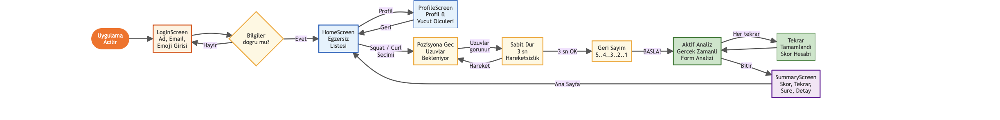
</p>

---

## Renk Teması

Uygulama **Neon Orange** teması ile tasarlanmıştır:

| Renk | HEX | Kullanım |
|------|-----|----------|
| 🟠 Neon Turuncu | `#FF6B00` | Birincil renk, butonlar, vurgular |
| ⚫ Derin Siyah | `#0D0D0D` | Arka plan |
| 🔘 Koyu Kömür | `#1A1A1A` | Yüzey ve kartlar |
| 🟢 Yeşil | `#4CAF50` | Başarılı form geri bildirimi |
| 🟡 Turuncu | `#FF9800` | Uyarı geri bildirimi |
| 🔴 Kırmızı | `#FF4444` | Kritik hata geri bildirimi |

---

## Yol Haritası

- [x] MediaPipe Pose Landmarker entegrasyonu
- [x] CameraX ile gerçek zamanlı görüntü işleme
- [x] Squat analiz modülü (8 fazlı state machine)
- [x] Dumbbell Curl analiz modülü (8 fazlı state machine)
- [x] Dominant taraf otomatik tespiti
- [x] Egzersize özel iskelet çizimi
- [x] Üç aşamalı başlangıç sistemi (görünürlük + hareketsizlik + geri sayım)
- [x] Geri bildirim debounce mekanizması
- [x] Tema bağımsız geri bildirim renklendirmesi
- [x] Profil ve vücut ölçüleri ekranı
- [ ] Room veritabanı ile kalıcı veri saklama
- [ ] Lunge egzersiz analizörü
- [ ] Push-up egzersiz analizörü
- [ ] Kilo geçmişi grafik ekranı
- [ ] Firebase Authentication entegrasyonu
- [ ] Antrenman geçmişi ve ilerleme grafikleri

## Lisans

Bu proje [MIT Lisansı](LICENSE) ile lisanslanmıştır.

---

## İletişim

**Malik Enes Alpaslan** — [malikenesalpaslan@hotmail.com](mailto:malikenesalpaslan@hotmail.com)

Proje Linki: [https://github.com/enesalpaslan/FitFormAI](https://github.com/enesalpaslan/FitformAI)
---


<p align="center">
  ISUBÜ Teknoloji Fakültesi — Bilgisayar Mühendisliği Bölümü<br/>
  Bilgisayar Mühendisliğinde Proje Uygulamaları Dersi — 2025/2026
</p>
